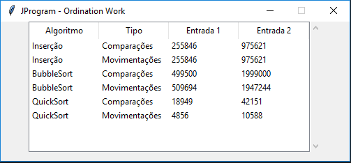

# Ordination-Work

### --> Execution of the work:

__(PT-BR) {__
    
    descricao = "
        
        Trabalho Prático Final da disciplina Análise de Algoritmo, UNIBH, 7 periodo. O Objetivo do trabalho foi de implementar 
        os seguintes algoritmos de ordenação: Inserção, Bubblesort e Quicksort para determinar o número de comparações e 
        movimentações para ordenar os arquivos Entrada1.csv e Entrada2.csv.
    
    ";
    
    implementado = "
    
        Neste trabalho, foi implementado os algoritmos de ordenação que informa os valores de comparações e movimentações, 
        além disso, foi implementado com a interface gráfica, utilizando TKinter, para mostrar no final da execução uma tabela 
        com as informações dos algoritmos.
        
    ";
__}__

__(ENG) {__
  
    description = "
        
        Final Practical Work of the course Algorithm Analysis, UNIBH, 7 period. The objective of the work was to implement
        the following sorting algorithms: Insertion, Bubblesort and Quicksort to determine the number of comparisons and
        moves to sort the files Entrada1.csv and Entrada2.csv
    
    ";
    
    implemented = "
        
        In this work, the ordering algorithms that inform the values ​​of comparisons and movements,
        in addition, it was implemented with the graphical interface, using TKinter, to show at the end of the execution a table
        with the information from the algorithms.
    
    ";
__}__
